# Introduction

This is the third project of Udcaity Self-Driving Car Engineer Nanodegree program. 

Here is the 4 major files of the project:

* model.py 

    containing the script to create and train the model
    
    
* drive.py 

    for driving the car in autonomous mode
    
    
* outputs/steering_model/steering_angle.h5model.h5 

    containing a trained convolution neural network
    
    
* writeup_report.md or writeup_report.ipynb 
    
    this file, which summarizing the results
    
The car can be driven autonomously around the track by executing `$ python drive.py ./outputs/steering_model/steering_angle.h5`


```python
from collections import Counter
import csv

import cv2
import matplotlib.gridspec as gridspec
import matplotlib.image as mpimg
import matplotlib.pyplot as plt
import numpy as np
import scipy.ndimage as sndi


%matplotlib inline
```


```python
def show_steering_angle_distribution(y_train, groups = 500):
    plt.title("Steering angle distribution in data")
    plt.hist(y_train, groups)
    plt.show()
    
    positive_angle = [i for i in y_steering if i > 0]
    nagative_angle = [i for i in y_steering if i < 0]
    zero_angle = [i for i in y_steering if i == 0]

    print('number of positive angle:', len(positive_angle))
    print('number of negative angle:', len(nagative_angle))
    print('number of zero angle:', len(zero_angle))
```

# Raw data loader

I stated my network with data provided by Udacity. However, I found that I may need extra data because the model is not working well. So I drove the car, and collected 10 more groups of training data.


```python
drive_log_files = [
    'driving_log.csv', # data provided by Udacity
    'additional_data_1/driving_log.csv', # 2 full laps
    'additional_data_2/driving_log.csv', # 5 runs, from the begining of the first curve to the bridge
    'additional_data_3/driving_log.csv', # 3 full laps
    'additional_data_4/driving_log.csv', # 3 runs, from the begining of the first curve to the starting point of trainig mode
    'additional_data_5/driving_log.csv', # 5 runs show that how to get back to the middle of the road while the car is going to leave the road
    'additional_data_6/driving_log.csv', # 5 runs show that how to get back to the middle of the road while the car is running on the lane line
    'additional_data_7/driving_log.csv', # 6 run, from the begining of the road fork to the point where the roads merge
    'additional_data_8/driving_log.csv', # 5 runs, from the end of the first curve to the end of the bridge
    'additional_data_9/driving_log.csv', # 1 run, from the end of the bridge to the starting point of training mode
    'additional_data_10/driving_log.csv' # 4 full laps
]
```


```python
X_center = []
X_left = []
X_right = []
y_steering = []

for drive_log_file in drive_log_files:
    with open(drive_log_file, 'rt') as csvfile:
        reader = csv.reader(csvfile, skipinitialspace=True)

        next(reader) # skip the first row

        i = 0
        for row in reader:
            i = i+1
            X_center.append(row[0])
            X_left.append(row[1])
            X_right.append(row[2])
            y_steering.append(float(row[3]))

X_center = np.array(X_center)
X_left = np.array(X_left)
X_right = np.array(X_right)
y_steering = np.array(y_steering)
```

# Data exploration

## 1. Steering angles


```python
show_steering_angle_distribution(y_steering)
```


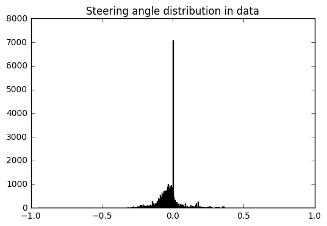


    number of positive angle: 7224
    number of negative angle: 23174
    number of zero angle: 6606


First of all, I notice that the number of samples with around zero steering angle are much higher then any other. It may because the car is driving on a strength line most of the time. The car may not have to adjust the steering angle unless there is a curve.

On the other hand, I find that the number of sample with negative steering angle is much higher that the positive one. It is because the track we used has many left turns but only one right turn. So if the car needs to turn, then the chance that the car turns left is higher then a right turn.

If we train on these sample directly, we may obtains a model that perfer driving strength or turning left, and resisting to turning right. The model may be overfitting.

As a result, we may need to adjust the distribution before training.

## 2. Camera images

### a. Use side camera images


```python
fig = plt.figure()

index = 25 

a=fig.add_subplot(1,3,1)
img = mpimg.imread(X_left[index])
imgplot = plt.imshow(img)
plt.gca().axes.get_xaxis().set_visible(False)
plt.gca().axes.get_yaxis().set_visible(False)
a.set_title('Left')

a=fig.add_subplot(1,3,2)
img = mpimg.imread(X_center[index])
imgplot = plt.imshow(img)
plt.gca().axes.get_xaxis().set_visible(False)
plt.gca().axes.get_yaxis().set_visible(False)
a.set_title('Center')

a=fig.add_subplot(1,3,3)
img = mpimg.imread(X_right[index])
imgplot = plt.imshow(img)
plt.gca().axes.get_xaxis().set_visible(False)
plt.gca().axes.get_yaxis().set_visible(False)
a.set_title('Right')
```


    <matplotlib.text.Text at 0x114ae8940>


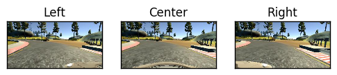


Each sample contains three images from different cameras. All carmera are facing forward, however, they are in differnce positions. 

If the center camera captures an image similar to the image from left camera, then the car may be on the left of the road and it should turns a little bit right, such that the center image should looks like what we seen in the sample. We may add ±0.15 steering angle to side camera images, to simulate the situration that the car is driving on the side way, and it should turn a little bit. 

If we use both side camera images, we will have triple number of sample images for training.

### b. Flip images


```python
def fliped_image(image):
    return cv2.flip(image, flipCode=1)
```


```python
fig = plt.figure()

index = 25

a = fig.add_subplot(1,2,1)
img = mpimg.imread(X_left[index])
imgplot = plt.imshow(img)
plt.gca().axes.get_xaxis().set_visible(False)
plt.gca().axes.get_yaxis().set_visible(False)
a.set_title('Original')

a = fig.add_subplot(1,2,2)
img = mpimg.imread(X_center[index])
imgplot = plt.imshow(fliped_image(img))
plt.gca().axes.get_xaxis().set_visible(False)
plt.gca().axes.get_yaxis().set_visible(False)
a.set_title('Fliped')
```


    <matplotlib.text.Text at 0x115c736a0>


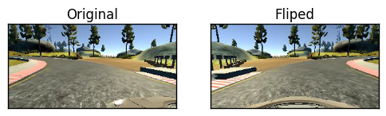


The image can be fliped, and the fliped sample should have a steering angle with oppsite signs. Let say we fliped an image with steering angle 0.5, then the fliped image should have steering angle -0.5. 

As a result, we have double our training images. And we should have equal numbers of sample with positive and negative angle. 

By the way, fliping an image with 0 steering angle results in a new sample with zero steering angle. In order to reduce the difference in samples with and without zero steering angle, no image with zero steering angle will be fliped.

# Data preprocessing

## 1. Multiply images


```python
# use side camera images
y_steering_left = y_steering + 0.15
y_steering_right = y_steering - 0.15
y_steering = np.append(y_steering, y_steering_left, axis=0)
y_steering = np.append(y_steering, y_steering_right, axis=0)

# flip all images with non-zero steering angles
y_steering = np.append(y_steering, -(y_steering[y_steering != 0]), axis=0)
```


```python
show_steering_angle_distribution(y_steering)
```


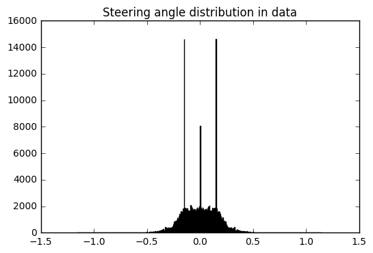


    number of positive angle: 104395
    number of negative angle: 104395
    number of zero angle: 6617


As I mentioned before, I will multiply number of samples by flipping images and using side camera images.

All the image with non-zero steering angle will be fliped and each fliped image will have steering angle in oppsite sign of the orignal one.

The steering angle of left camera image will be *original steering angle + 0.15*.

The steering angle of right camera image will have steering angle equals to *original steering angle - 0.15*.

## 2. Tuning given image


```python
def get_cropped_image(image):
    shape = image.shape
    height = shape[0]
    width = shape[1]
    return image[65:height-35, 0:width]
```


```python
def get_image_in_yuv(image):
    return cv2.cvtColor(image, cv2.COLOR_RGB2YUV)
```


```python
def get_resized_image(image):
    return cv2.resize(image.astype(np.uint8), (200, 66), cv2.INTER_AREA)
```


```python
def get_blured_image(image):
    return cv2.bilateralFilter(image,9,75,75)
```


```python
def get_preprocessed_image(image):
    image = get_cropped_image(image)
    image = get_resized_image(image)
    image = get_image_in_yuv(image)
    image = get_blured_image(image)

    return image
```


```python
fig = plt.figure()

index = 25

a = fig.add_subplot(1,2,1)
img = mpimg.imread(X_center[index])
imgplot = plt.imshow(img)
plt.gca().axes.get_xaxis().set_visible(False)
plt.gca().axes.get_yaxis().set_visible(False)
a.set_title('Original')

a = fig.add_subplot(1,2,2)
img = get_preprocessed_image(mpimg.imread(X_center[index]))
imgplot = plt.imshow(img)
plt.gca().axes.get_xaxis().set_visible(False)
plt.gca().axes.get_yaxis().set_visible(False)
a.set_title('Preprocessed')
```


    <matplotlib.text.Text at 0x115804c18>


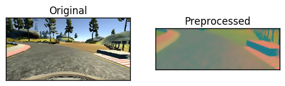


All images will be preprocess by 4 steps. They are **Cropping**, **Resizing**, **Converting colorspace** and **Bluring**.

The detail of each steps are descriped as follow.

### a. Crop image


```python
fig = plt.figure()

index = 25

a = fig.add_subplot(1,2,1)
img = mpimg.imread(X_center[index])
imgplot = plt.imshow(img)
plt.gca().axes.get_xaxis().set_visible(False)
plt.gca().axes.get_yaxis().set_visible(False)
a.set_title('Original')

a = fig.add_subplot(1,2,2)
img = get_cropped_image(mpimg.imread(X_center[index]))
imgplot = plt.imshow(img)
plt.gca().axes.get_xaxis().set_visible(False)
plt.gca().axes.get_yaxis().set_visible(False)
a.set_title('Croped')
```


    <matplotlib.text.Text at 0x115406748>


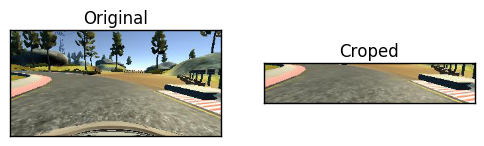


The lower part of the images contain the car body and no lane lines. The lower parts contain no useful information for determine steering angle, so it should be safe to remove them. I remove the upper 65px from the sample.

The upper part of the images include sky and trees but not the road or lane line. The steering angle should not count on the sky or trees, so it should be safe to remove the upper part of the images. I remove the lower 35px from the sample.

### b. Convert colorspace to HSV


```python
fig = plt.figure()

index = 25

a = fig.add_subplot(1,2,1)
img = mpimg.imread(X_center[index])
imgplot = plt.imshow(img)
plt.gca().axes.get_xaxis().set_visible(False)
plt.gca().axes.get_yaxis().set_visible(False)
a.set_title('RGB')

a = fig.add_subplot(1,2,2)
img = get_image_in_yuv(mpimg.imread(X_center[index]))
imgplot = plt.imshow(img)
plt.gca().axes.get_xaxis().set_visible(False)
plt.gca().axes.get_yaxis().set_visible(False)
a.set_title('HSV')
```


    <matplotlib.text.Text at 0x1153cabe0>


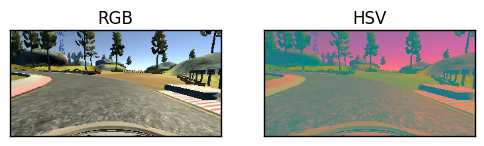


Nvidia paper suggested that we can use HSV colorspace.

Seems that the boarder of the road is more obvious in HSV colorspace, so I decided to use HSV colorspace instead of RGB.

### c. resize image


```python
fig = plt.figure()

index = 25

a = fig.add_subplot(1,2,1)
img = mpimg.imread(X_center[index])
imgplot = plt.imshow(img)
plt.gca().axes.get_xaxis().set_visible(False)
plt.gca().axes.get_yaxis().set_visible(False)
a.set_title('Original')

a = fig.add_subplot(1,2,2)
img = get_resized_image(mpimg.imread(X_center[index]))
imgplot = plt.imshow(img)
plt.gca().axes.get_xaxis().set_visible(False)
plt.gca().axes.get_yaxis().set_visible(False)
a.set_title('Resized')
```


    <matplotlib.text.Text at 0x1159199b0>


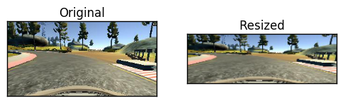


Nvidia paper recommands that we can use image with size (200, 66).

Because I may want to use Nvidia model, so I decided to follow their suggestion and  resize the image to (200, 66)

### d. Blured image 


```python
fig = plt.figure()

index = 25

a = fig.add_subplot(1,2,1)
img = mpimg.imread(X_center[index])
imgplot = plt.imshow(img)
plt.gca().axes.get_xaxis().set_visible(False)
plt.gca().axes.get_yaxis().set_visible(False)
a.set_title('Original')

a = fig.add_subplot(1,2,2)
img = get_blured_image(mpimg.imread(X_center[index]))
imgplot = plt.imshow(img)
plt.gca().axes.get_xaxis().set_visible(False)
plt.gca().axes.get_yaxis().set_visible(False)
a.set_title('Resized')
```


    <matplotlib.text.Text at 0x115beaa58>


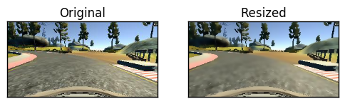


The pattern of the road is meaningless, so I blured the image.

Although the images are blured, the border is still obvious.

# Training

## Network structure

The model I used is based on the steering model provided by comma.ai.

Most the the layer are kept, and only the normalization layer is changes, I updated the Lambda layer parameter from `Lambda(lambda x: x/127.5 - 1., input_shape=(ch, row, col), output_shape=(ch, row, col)` to `Lambda(lambda x: x/255 - 0.5, input_shape=shape)`, such that the channel is kept as the last parameter, and the formula that I used to get the normalized value is changed. The Lambda layer I used is copied from the Q&A session video on YouTube.

The summary of my network is mentioned below:
```
____________________________________________________________________________________________________
Layer (type)                     Output Shape          Param #     Connected to                     
====================================================================================================
lambda_1 (Lambda)                (None, 66, 200, 3)    0           lambda_input_1[0][0]             
____________________________________________________________________________________________________
convolution2d_1 (Convolution2D)  (None, 17, 50, 16)    3088        lambda_1[0][0]                   
____________________________________________________________________________________________________
elu_1 (ELU)                      (None, 17, 50, 16)    0           convolution2d_1[0][0]            
____________________________________________________________________________________________________
convolution2d_2 (Convolution2D)  (None, 9, 25, 32)     12832       elu_1[0][0]                      
____________________________________________________________________________________________________
elu_2 (ELU)                      (None, 9, 25, 32)     0           convolution2d_2[0][0]            
____________________________________________________________________________________________________
convolution2d_3 (Convolution2D)  (None, 5, 13, 64)     51264       elu_2[0][0]                      
____________________________________________________________________________________________________
flatten_1 (Flatten)              (None, 4160)          0           convolution2d_3[0][0]            
____________________________________________________________________________________________________
dropout_1 (Dropout)              (None, 4160)          0           flatten_1[0][0]                  
____________________________________________________________________________________________________
elu_3 (ELU)                      (None, 4160)          0           dropout_1[0][0]                  
____________________________________________________________________________________________________
dense_1 (Dense)                  (None, 512)           2130432     elu_3[0][0]                      
____________________________________________________________________________________________________
dropout_2 (Dropout)              (None, 512)           0           dense_1[0][0]                    
____________________________________________________________________________________________________
elu_4 (ELU)                      (None, 512)           0           dropout_2[0][0]                  
____________________________________________________________________________________________________
dense_2 (Dense)                  (None, 1)             513         elu_4[0][0]                      
====================================================================================================
Total params: 2,198,129
Trainable params: 2,198,129
Non-trainable params: 0
```

## Training process

I first started with Udacity data, and the car leaves the road at the first lap. I think the model is over fitting.

In order to fix the overfitting, we can tune the network or add additional data. I do not want to tuning the parameters, so I decidied to solve the problem by feeding more data to the network.

Once I find that the car cannot finish the race, then I will start recording new training data. The new training data may be a full laps or only part of the track. If the new training data contains only part of the track, then the training is forced on fixing a specified problem.


```python
image = mpimg.imread('Screen_Shot_1.png')
plt.imshow(image)
plt.title('The car leaving the road')
```


    <matplotlib.text.Text at 0x115753240>


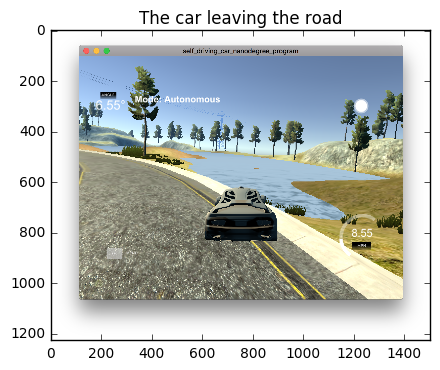


After my trial ends with above situration, I started collecting *additional_data_5*, which shows how to get back to the middle of the road while the car is going to leave the road. 


```python
image = mpimg.imread('Screen_Shot_2.png')
plt.imshow(image)
plt.title('The car driving on the lane line')
```


    <matplotlib.text.Text at 0x114428390>


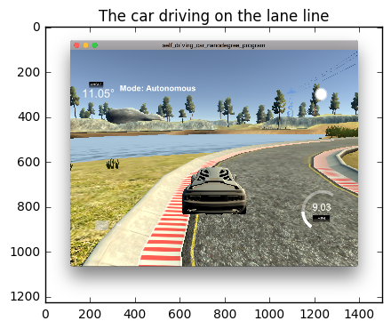


Although my car didn't cross the border, I believed it was too dangous to drive on the lane line, so I started collecting *additional_data_6*, which shows how to get back to the middle of the road from the lane line.

# Outcome

The final output of my network on the sample track (Click to play on YouTube)

[](https://www.youtube.com/watch?v=xj-v50t6qS0)

# Credits

[comma.ai](https://github.com/commaai/research) -- The architecture of steering angle model, the code for saving the model. All of these are released under [BSD License](https://github.com/commaai/research/blob/master/LICENSE)

[Udacity](https://www.udacity.com) -- Sample data and the base of the repo


```python

```
